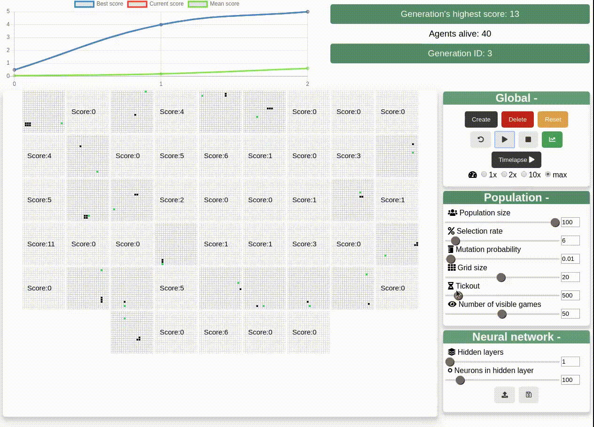
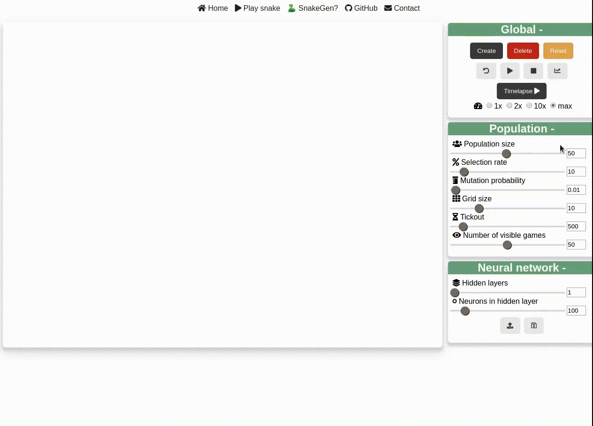

# SnakeGen 🐍

    

Above is a demo after few generations of evolution. Exciting, right? Check the [quickstart](#quickstart) section to know how to use it and head to this [website](http://projects.victormeunier.com/snakegen/index.html) to test it live!

## What is it ?

SnakeGen is an implementation of the basic genetic algorithm applied to neural networks. An **environment** is created and will evolve multiple **generations**. Each of them has a certain amounts of **agents**, that have their owns genes (a neural network) to play snake.

### Genetic algorithm

There are a lot of implementation of the idea of genetic algorithms. We went with something simple, that mimics what we can observe in nature. The algorithm is as follows:

1. Create an initial generation of agents with random genes (random weights in the neural net)
2. Let the agents play or train on the task you assigned and keep track of how they're doing (their **fitness**)
3. Judge the agents based on their **fitness** and class them in descending order
4. Select X% of the fittest agents
5. Use these selected agents to breed a new population (create offsprings)
6. *(Optional) Keep the selected agents untouched for the next generation (elitism)*
7. Randomly mutate X genes of Y amount of the newly bred agents 
8. Goes to 2 and repeat until goal is reached

## What are we trying to achieve ?

### Goal

With this project we are first trying to have a better understanding of genetic algorithms (GA) and how they can be used to find the optimal weights of a neural network on a given task. The task here is the game snake. The goal for the agent, is to maximize its score (number of fruit eaten).

The interesting about GA is the ability of letting agents evolve to find themselves the best way to resolve a problem. In our approach, we are trying to be "as real" as possible, by giving kind of a realistic vision of the snake's environment to the agent. We want to give the agent the most unbiased view possible, in hope that it's going to be able to create a good internal representation of its environment and objective. 

## How to use ?

### Quickstart

#### Global

| Control | Action | Comment |
|---|---|---|
| Create | Create an environment with the parameters specified under *population* |   |
| Delete | Delete the current environment |   |
| Reset | Reset all the population's parameters | Default parameters are what we empirically found to be the best to quickly get good results |
| Play/Pause | Play or pause the training |   |
| Chart | Display / hide the training information |   |

#### Population

In this section, you find all the controls relative to the population you create. Here are all the sliders and what they do:

| Control | Action | Comment |
|---|---|---|
| Population size | Controls the number of agents to be created | The bigger the population the easier it is to find good agents |
| Selection rate | Percentage of the best agents to be selected to breed next generation | Keep selection rate low (<=10%) to take only the best agents |
| Grid size | Size of the game's grid | The bigger the grid is, the longer the snake can grow |
| Tickout | Maximum number of step before ending the game | A longer tickout will allow agents to play longer and thus grow longer. This reduces training time though |
| Number of visible games | Games to be displayed | Keep a low number of visible games if you're computer is having trouble running the simulation |

### Saving / loading weights

**! IMPORTANT: This might only work with Chrome !**

Weights of all the neural nets can be saved or load with the two buttons found under the *Neural network* section. The left button is used to upload weights in JSON format and the right button is used to save the current weights.

This is handy to stop and resume training later on, or to share your weights with people. If you have amazing weights, don't hesitate to send them to us!

#### Saving

Simply hit the save button in the *Neural network* section. All of your agent's neural net's weights are saved in a JSON file.

*Note: Saving weights only save the neural nets weights and number, thus all other population information will be lost (grid size, tickout, etc..).*

#### Loading 

Click on the load button in the *neural network* section, select a JSON weight file on your computer and accept to create new agents based on the weights. The weights are read and used to create the same number of agents that were when you saved the file.

*Note: Loading weights will only create the required amounts of agent with the saved weights. Thus, the grid size, tickout, selection rate, etc... could differ. For example, it's possible to load trained weights on a 30x30 grid in a new environment with a grid of only 10x10.*

###### Loading provided weights

A file *good_weights.json* is provided and contains relatively good weights. If you want to import it using the same environment it was created with, simply use the following:

- Population size: 100
- Selection rate: 10%
- Grid size: 20x20
- Tickout: 500

*Note: Because the weights are quite good, you could increase the grid size and use a longer tickout to further train the agents.*

### Timelapse

**! IMPORTANT: This might only work with Chrome !**  
**NOTE: You might need to accept to "download multiple files from this website". If chrome asks you, click accept.**

You think you've found the right parameters and your agents are performing really well? Or you just want to see the beauty of hours of evolution in a few seconds? Simply press the *timelapse* button, and enjoy! An render of the HTML will be made every X seconds and save on your computer.