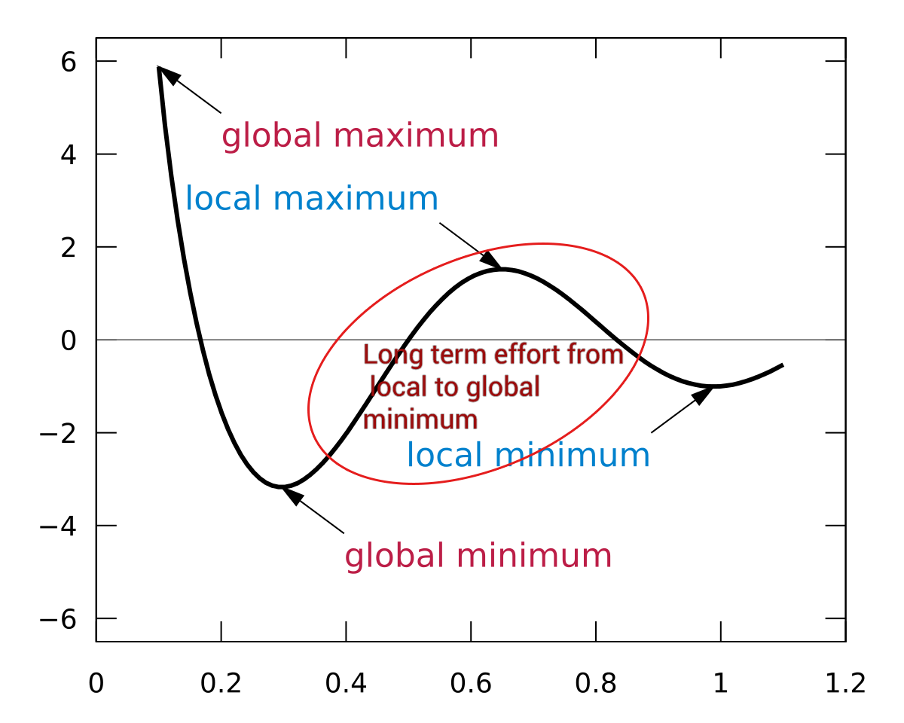
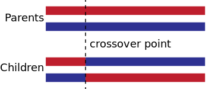

# Genetic Algorithm

In here, you'll find some explanatiions about genetic algorithm, how we use them with neural networks and what algorithms we decided to use.

The main idea of genetic algorithm(s) is to mimic the natural evolution observed in our world. The individuals of a population will adapt over time to their environment by modifying their genome. The "fittest" will survive, and reproduce, transimitting their "superior" genes to the next generation. With that, we can hope that the Xth generation is going to perform better than the first one.

This type of algorithm being strongly dependant on randomness, can be really slow to converge. Even in the case of a conversion, it is often to a local minima. This is due to the fact that it's hard to sacrifice short term reward for long term benefits. 

## Selection

Selection is the action of chosing indivuals for their **genome** from a population for later **breeding** (see [breeding section](##Breeding)). The breeding will use the **crossover** operation (see [crossover section](##Crossover))

A typical selection procedure could be as follows:

1. A **fitness function** evaluates each indivual == evaluate their perfomance for the given task.
2. Population is sorted by descending fitness values
3. The top X individuals with the highest fitness functions are chosen and will breed.

*Note: Elitism consists of retaining the best indivuals in a generation unchanged*

## Breeding

Breeding is the act of reproduction between two individuals. It's often using crossover to obtain one or more offsprings.

## Mutation

In classical GA, mutation is the act of changing randomly only one gene in each offsrping. In our case, the genome is the neural net's weights. Changing only one weight in a matrix of maybe 100 values is not much, so we can decide to change for example 10% of the weights. There are no rules for that, changing a higher percentage could just speed up the process.

There are different types of mutation, see this [wikipedia link](https://en.wikipedia.org/wiki/Mutation_(genetic_algorithm)) for more information.

## Crossover

Crossover is the action of selecting a point where the two parent's chromosomes are swapped. Variants of that include k-points crossover or uniform crossover.  
  

In the case of neural network, the crossover could be seen, not as a point, but as line, separating the weights matrix , in what we would call the one line or k-line crossover. 

