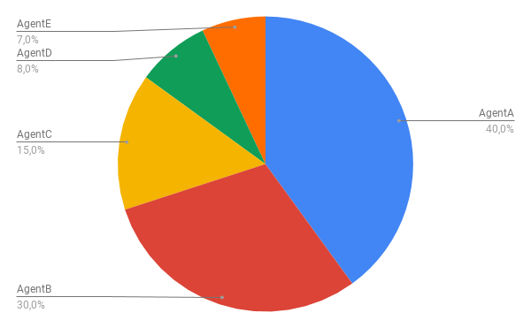
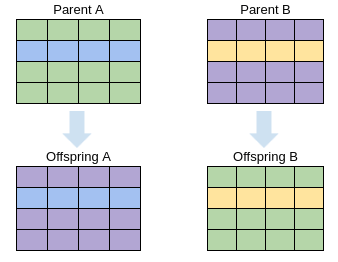
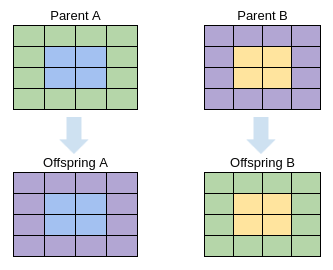

# Blogpost

## Victor's notes

### Keypoints

- Correctly measuring fitness is hard
- Evolution will always take advantage of the flaws of the game, or the scoring system
- Evolution is strongly dependant on randomness (especially at the beginning)
  - There are ways to counter that though

### Layout

1. Introduction
    - Origin of the project
    - What's the goal
      - Learn the principle of MGNN
      - Training tool
2. Introduce GA
    - Concept
    - Selection
    - Breeding / Crossover
    - Mutation
3. Computation
    - Neural net (inputs, hidden layers, outputs)
    - Selection
    - Breeding / Crossover
    - Mutation
    - Judging fitness intelligently
      - Judging only the score
      - Adding death
      - Adding distance score
4. Conclusion
    - Hard to achieve good result but super fun
      - Genetic patrimony destruction
      - Parameters influence on the results
    - Evolution coming back (see weightless NN paper)

### Redacted

#### Origin

SnakeGen originated as a small 'weekend project' to gain some insights about genetic algorithms and how they can be used to evolve a neural network. This project was supposed to be short and simple, but complex enough to understand genetic algorithms. It would be a first step in reinforcement learning, with the goal of moving on to a harder problem. 

The next problem would be to teach some kind of robot, how to do something. It had to be simple because all of the learning would happen in simulation, either 2D or 3D. Then this knowledge would be transferred to a real robot to see how the learning in simulation could transfer to real life. Obviously, it wouldn't be as easy as this because the simulation would most likely not be perfect and there's a lot of parameters to consider in our real world. But it would be a fun project, that would surely teach me a lot.

Well, by the way I'm writing this, you understand that everything didn't go as planned. When I had these ideas, I told my friend Mathieu what I was planning to do, and asked him if he wanted to join me in the process. He agreed and we started working on SnakeGen. Because we were two on that project, we had much more working power, ideas and goals. The project slowly became bigger than a weekend project, and we decided to investigate as best as we can the inner workings of genetic algorithms. Also, to be honest, not everything went as smoothly as planned! It happens that evolving a neural net to play a game is not as easy as it seems! 

This blogpost represents the end of the SnakeGen project, and hopefully marks the beginning of another collaboration!

#### Selection

When you're trying to evolve a population, you have to select part of it to create the next one. In our world, natural selection occurs when people die. It could be of old age, a disease, an accident, etc.. In the case of our snake game, there's no real death, at least in the way we implemented it. We'll artificially select the best individuals to breed the next generation. Usually, you want a very selective process where you get a low percentage of the present generation. This is to ensure that you'll pass only the best genes, and that your population will converge fast enough to a great score. In our case, we always stay below 10% of the population, and that is already quite high. This is a good starting point, but we can do better...

##### Let's play roulette

In order to be a bit more fair, we'll give a proportional chance of reproduction based on the fitness. This can be seen as a roulette, where each agent has a part of it, proportional to its score. This means that the higher the score, the higher the chance of reproduction. Please note that we are talking of **chance** of reproduction. This is not for sure, because we are still using randomness, but biased with the scores.

##### Elitism FTW

To make the convergence even faster we can be elitist with our agents, meaning we'll keep the best agents untouched for the next generation. This means that we ensure the top performing agents we'll have a chance to shine again. It's possible to limit the elitism, by selecting only few agents in the already selected agents. In our case, all the selected agents are considered 'the elite', and thus passed to the next generation untouched. When we say untouched, we mean that no mutation is occurring. Mutation only happens when there's a breeding, it's a inherent part of the reproduction process.

##### Sprinkle some randomness on top

One last thing that could be done to improve the selection process is to add randomness. In real life, some individuals are not particularly good but get lucky and survive long enough to breed. In the case of our game, this could be seen as an agent not performing really well, but getting luckily selected to breed. But, why would you select a not well performing agent? It doesn't make sense! Well... it's possible that this agent as some interesting weights in its genes but they are hidden because of some other bad weights. By allowing him to breed, it might give its potentially good weights to its children, which might lead to a good performing agent.

All of that is really interesting, but we still don't know how we get the agent's scores! Don't worry, we'll see that soon.

#### Breeding/Crossover

In Genetic Algorithm, you don't necessarily use breeding to produce new offspring. In our case, we decided to use a gendered breeding to mimic what we can't see in nature. More precisely, we are using a technique called **crossover**. The idea is to take part of parent A and part of parent B to create one or more offspring. The 'genes' we are taking from the parents are the neural network's weights. Because we are dealing with a 2D matrix of weights, we can implement the crossover in many ways. We chose to implement two techniques:

1. Line crossover: One or more line in the parentB matrix is chosen and will replace the one of parentA to create the offspring. The number of lines and their position in the matrix can and must be random.
2. Patch crossover: A 'patch' or a small 2D matrix is chosen from parentB to replace the corresponding part in parentA. The size and the position of the patch are random. You can limit the size of the patch otherwise it can be as big as the weights matrix itself, basically using only the genes of one parent.

Now that we know how it works, we understand the importance of this method to mix genes. Without that, we would rely only on random mutation to evolve, and it could be a really long and tedious process, that would eventually never converge. By mixing the best parent's weights, we try to create offsprings that have all the qualities of their parents. Obviously it also means that some of them will actually get the 'bad weights' and will probably perform really poorly. This is not a problem, as they will eventually die and not reproduce.

---

**BELOW IS NOT WHAT I WAS SUPPOSE TO REDACT, JUST SOME THOUGHTS AND OBSERVATION**

#### Goal

Our goal was to use genetic algorithm (selection, breeding and mutation) to evolve an agent's neural network to play snake.

#### Inputs / outputs

When you want an agent to play a human game, you have to think about what vision of the game your agent will have. Us human, see the entire grid of the game at once, with the position of our snake and the food. That could be a way for our agent to see the world, each cell of the grid or even every pixel could be an input.

In our case, we chose the second option, which is to take the snake's perspective. This case is closer to what a robot would see. We wanted to give it a more realistic view and that's why we went with a combination of "lines of sight", "cones of sight" and a sens for fruit presence. That gives us a total of 11 inputs (3 lines of sight, 4 cones of sight, 4 cones of fruit presence).

Let us explain you what they are precisely.

##### Lines of sight

From the snake's head, 3 "beam" will travel to its left, its right and forward, giving him a sense of the distance between its head and an eventual obstacle. These lines of sight are basically infinite in our case, but they could easily be limited, to simulate a more real environment.

##### Cones of sight / Fruit presence

To give our agent a more "realistic view", we wanted to add some kind of "continuous" vision of the world. We added what we call "cones of sight" which are basically 4 cones. The inputs are simply the area of each cones.

On the same principle, 4 more inputs will have the fruit presence in the 4 previously defined cones. By having 4 separate inputs for the fruit presence we give the agent the ability to prioritize what is important for him. The cones of sight could be used to determine the best path (where there are more space to move) while the fruit presence input give the agent a general direction towards the goal.

##### Outputs

The outputs are pretty straight forward, again we use the snake's perspective. The agent can go forward, left and right. Going backward is not possible for multiple reasons, but basically because it's not useful and would result in the snake dying instantly when its size is at least two.

#### Snake's performance

First of all, we tried for a long time to judge the snakes only at the end of their game. We would evaluate their score and the time they stay alive. The problem is that it's like trying to monitor the progress of someone with the eyes banded during their training.. It's not very effective, and that's quickly showing up in the snakes' behavior. They eventually start to go in circle forever. That assure them to stay alive. Because we also monitor the score, they will eventually start by eating a few fruits, but will go back to circles. 

To solve that, we need a way to monitor them continuously. We will still not interfere while they are playing, but we'll evaluate each of their move. At each step, we calculate the euclidean distance between the head and the fruit. If the snake moves away it looses distance points, and the opposite happens if it moves towards the fruit. By doing that, we no longer judge the snake only at the end, we have a vision of its behavior through the whole training. It makes it easier to select snakes that tend to go towards the fruit.

In general in reinforcement learning, how you choose to evaluate your agent is key. Keep in mind that your agents will evolve to be better at what you evaluate them.

### General observations

- **Population size** is quite important. A bigger population will converge faster. This is because we have more chance of finding good genes.
- Parameters such as **grid size** and **tickout** can be limiting factors. At first, you don't want a tickout too big because most snakes will probably die or go in circle. As generation pass, agents are better and a bigger tickout allow them to grow longer by eating more fruit. If you see your agents being stuck on a maximum score for a few generations, save the weights, make the tickout bigger and reload the weights. That way, your agents will have more time and will thus continue to evolve and grow.
- **Selection rate** is important and keeping low generally result in better individuals faster. That is because by having a strict selection, you only keep the best of the available genes. Also, because selection is elitist, the best agents will go to the next generation unchanged, having the possibility to shine again.
- Playing with score factor can lead to interesting behavior. Take the **tickcount** factor for example. If pushed to high compared to the score and the distance score, agents will be rewarded more if they stay alive, no matter if they eat fruits or not. Because of that, they'll tend to go in circle. On the opposite side, if the *distance factor* is too high, agents are rewarded by moving towards the fruit. No matter if they eat the fruit or not, they are better just moving towards it. They'll basically move in straight lines towards the fruit and die. Finding the balance between these 3 factors is hard. One could think about a way to choose these algorithmically... with genetic evolution for example... ;)